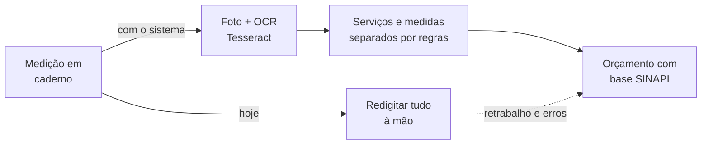

<a href="https://gotardon1.github.io/GotardoN1/#projeto/ocr-obras">
  <picture>
    <source media="(prefers-color-scheme: dark)" srcset="https://raw.githubusercontent.com/GotardoN1/GotardoN1/main/assets/projetos/ocr-obras-estudo-dark.svg">
    
  </picture>
</a>

**[Ver no portfólio interativo](https://gotardon1.github.io/GotardoN1/#projeto/ocr-obras)** · **[Sistema (funcionalidades e tecnologias)](https://github.com/GotardoN1/medicao-obras-ocr)** · **[Perfil](https://github.com/GotardoN1)**

## Sobre

Este repositório guarda o **estudo** por trás do app de medição e orçamento de obras com OCR: o problema, a pesquisa de campo e as decisões de engenharia. As funcionalidades e as tecnologias do sistema estão no repositório **[medicao-obras-ocr](https://github.com/GotardoN1/medicao-obras-ocr)**.

## 🎯 O problema

A pesquisa de campo com empresas do setor mostrou que a medição de obras ainda é feita quase sempre à mão, em cadernos e calculadoras. Isso causa:

- processos demorados e sujeitos a erro humano;
- dificuldade para ligar a medição de campo ao orçamento final;
- baixa produtividade na gestão dos dados.

## ✨ A solução

Um sistema desktop que concentra todo o fluxo:

1. **Modo manual**: digitação tradicional das medições.
2. **Modo semiautomático (OCR)**: o usuário envia fotos das anotações e o **Tesseract OCR** converte a imagem em texto. Em seguida, regras lógicas separam serviços e medidas.
3. **Integração com a SINAPI**: base de dados ligada à tabela nacional de custos da construção civil.

## 📊 Engenharia de software

| Prática | Como foi aplicada |
|---|---|
| **Modelagem UML** | Diagramas de classe, casos de uso e entidade-relacionamento (DER) |
| **Plano de testes** | Persistência de dados, integração do OCR e regras de negócio, como validação de CPF/CNPJ e segurança de senhas |
| **Metodologia ágil** | Tarefas organizadas em Kanban |
| **Tecnologias** | C++ orientado a objetos, Qt Creator, Tesseract OCR e Leptonica, MySQL e MySQL Workbench, Git |

## Neste repositório

| Arquivo | Conteúdo |
|---|---|
| [`Fabricio_Correa_de_Souza_Matheus_Goncalves_Gotardo.docx`](Fabricio_Correa_de_Souza_Matheus_Goncalves_Gotardo.docx) | Monografia completa do TCC |

## Autores

**Fabrício Corrêa de Souza** e **Matheus Gonçalves Gotardo**, com orientação do **Prof. MSc. Ricardo Massao Kagami**. Centro Universitário Campos de Andrade (UNIANDRADE), 2023.

---

Mais projetos: <a href="https://github.com/GotardoN1/medicao-obras-ocr">Sistema de medição com OCR</a> · <a href="https://github.com/GotardoN1/trena-digital-ux-ml">Trena digital com ML</a> · <a href="https://gotardon1.github.io/GotardoN1/#projetos">todos no portfólio</a>

